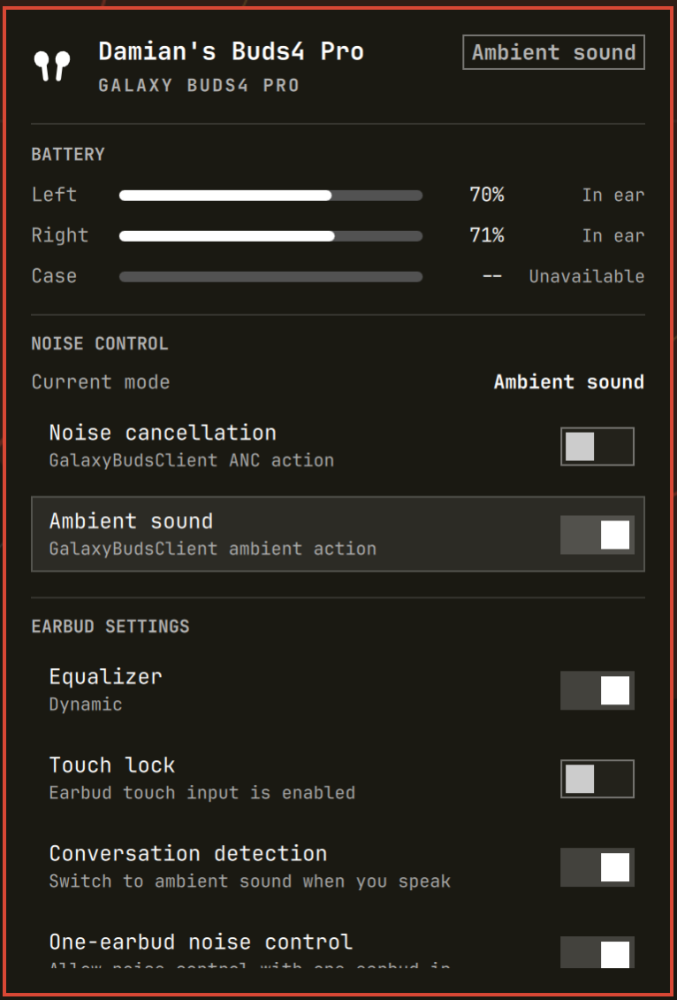

# Galaxy Buds for Omarchy

An Omarchy Quattro bar plugin for Galaxy Buds. It shows per-earbud status and
runs supported controls through
[GalaxyBudsClient](https://github.com/timschneeb/GalaxyBudsClient).

GalaxyBudsClient remains the only owner of the Buds protocol connection. This
plugin does not open Bluetooth or RFCOMM itself.

## Preview



## What the MVP includes

- left, right, and case battery when GalaxyBudsClient reports them
- charging and wear placement hints
- the current Off, Noise cancellation, Ambient sound, or Adaptive mode
- GalaxyBudsClient toggle actions for ANC and Ambient sound
- equalizer, touch lock, conversation detection, and one-earbud noise control
  when the connected model and decoded status support them
- a shortcut to the full GalaxyBudsClient window

GalaxyBudsClient can decode Adaptive mode, so the panel displays it when
reported. GalaxyBudsClient 5.2.1 cannot select Adaptive through its UI or
public action interface.

Bluetooth pairing, connection management, output selection, volume, and
microphone controls remain in Omarchy's stock Bluetooth and Audio panels.
Firmware updates, fit tests, gesture mapping, and detailed tuning remain in
GalaxyBudsClient.

## Requirements

- Omarchy Quattro
- GalaxyBudsClient 5.2.1 or newer available as `galaxybudsclient`
- Galaxy Buds already paired through BlueZ
- `busctl`, supplied by the systemd package used by Omarchy

The first version was checked against Omarchy 4.0 development packages,
Quickshell 0.3.0, and GalaxyBudsClient 5.2.1.

## Install

Clone the plugin through Omarchy without enabling it yet:

```bash
omarchy plugin add https://github.com/dgalarza/omarchy-buds.git
```

Install the status hook:

```bash
~/.config/omarchy/plugins/io.github.dgalarza.omarchy-buds/setup
```

`setup` only copies `galaxy-client/OmarchyBudsStatus.cs` into the active
GalaxyBudsClient script directory. It accepts either the current
`$XDG_DATA_HOME/GalaxyBudsClient/scripts` layout or the older
`$XDG_CONFIG_HOME/GalaxyBudsClient/scripts` layout. It first checks the path
reported in GalaxyBudsClient's application log, then existing data and config
layouts, and falls back to the current data layout for a new installation. It
does not install or restart GalaxyBudsClient, edit Omarchy settings, or enable
the widget.

The installed C# hook runs inside GalaxyBudsClient with the client's user
permissions. Review it before running `setup` when installing from a repository
you do not control.

Fully quit and relaunch GalaxyBudsClient once so its script manager loads the
hook. Then enable the widget:

```bash
omarchy plugin enable io.github.dgalarza.omarchy-buds
```

The icon is hidden while disconnected by default. To leave it visible for
setup and connection diagnostics:

```bash
omarchy bar set io.github.dgalarza.omarchy-buds hideWhenDisconnected false --json
```

## How it works

The C# hook subscribes to GalaxyBudsClient's decoded status and response
events. GalaxyBudsClient does not emit a fresh extended status packet for every
toggle, so the hook consumes the acknowledgement or mode-update response sent
back by the earbuds. It does not treat local action dispatch as device state.
A later extended status remains authoritative. The hook writes a
schema-versioned snapshot atomically to:

```text
$XDG_STATE_HOME/omarchy-buds/status.json
# fallback: ~/.local/state/omarchy-buds/status.json
```

The hook restricts the state directory to the current user (`0700`) and the
snapshot to user read/write access (`0600`).

`BarWidget.qml` owns the bar icon and forwards the standard panel lifecycle to
`Panel.qml`. `Service.qml` watches the status file with Quickshell `FileView`.
It also checks that GalaxyBudsClient still owns `me.timschneeberger.GalaxyBudsClient` on the user
bus and matches the bus owner's process ID to the snapshot writer. A bus owner
change triggers an immediate check; a 30-second poll is retained as a recovery
fallback for the monitor. A snapshot left behind by a crash is therefore
invalidated without waiting for the fallback poll.

Controls execute known `galaxybudsclient action -e ...` identifiers. The panel
accepts only the identifiers its parser recognizes and only renders an action
after the hook has observed a compatible device capability and an extended
status update.

The integration boundary is limited to `Service.qml` and
`galaxy-client/OmarchyBudsStatus.cs`. Protocol decoding remains upstream.

## Update

Update the repository, reinstall the external hook, and then fully restart
GalaxyBudsClient:

```bash
omarchy plugin update io.github.dgalarza.omarchy-buds
~/.config/omarchy/plugins/io.github.dgalarza.omarchy-buds/setup
```

The second step is required because Omarchy updates the plugin directory but
not the hook copy in GalaxyBudsClient's script directory. `setup` is idempotent
and reports when the installed hook is already current.

## Controls

A left click opens the panel. The switches invoke GalaxyBudsClient toggle
actions. The displayed value changes when the hook receives the matching
earbud acknowledgement or decoded update; a later extended status remains
authoritative.

| Key | Action |
|---|---|
| `j` / `k`, `↓` / `↑` | Move between available rows |
| `Enter` / `Space` | Activate the selected row |
| `n` | Toggle noise cancellation |
| `a` | Toggle ambient sound |
| `e` | Toggle the equalizer |
| `t` | Toggle touch lock |
| `c` | Toggle conversation detection |
| `o` | Toggle one-earbud noise control |
| `g` | Open GalaxyBudsClient |
| `r` | Reload status and client liveness |
| `Tab` / `Shift+Tab` | Move between bar panels |
| `Esc` | Close the panel |

Keys for unsupported or unavailable actions do nothing. There is no Adaptive
shortcut.

## Troubleshooting

**The icon is absent**

The default setting hides it while disconnected. Temporarily disable
`hideWhenDisconnected` with the command above. The open panel distinguishes a
stopped client, a missing hook, malformed status, and a disconnected device.

**The panel says the hook is not loaded**

Run `setup`, then fully quit and relaunch GalaxyBudsClient. Copying a C# script
while the client is running does not load it.

**The status file never appears**

Check GalaxyBudsClient's `application.log` in its data directory for
`OmarchyBudsStatus` or CSScript compiler errors. GalaxyBudsClient's scripting
API is the least stable part of this integration and may require an update to
the hook after a client release.

**A switch does not change**

The panel does not assume that a locally dispatched action reached the earbuds.
It keeps the previous value if GalaxyBudsClient reports a CLI failure or the
hook receives no matching device response. Check GalaxyBudsClient's log for a
Bluetooth or protocol error.

Touch lock uses GalaxyBudsClient's `LockTouchpadToggle` action. If touch lock is
also ineffective in the full client for a particular model or firmware, this
plugin cannot work around it without bypassing GalaxyBudsClient.

## Remove

Disable the widget, then fully quit GalaxyBudsClient so the loaded hook cannot
rewrite its state file:

```bash
omarchy plugin disable io.github.dgalarza.omarchy-buds
```

Remove the external hook and its state, then remove the plugin:

```bash
rm -f "${XDG_DATA_HOME:-$HOME/.local/share}/GalaxyBudsClient/scripts/OmarchyBudsStatus.cs"
rm -f "${XDG_CONFIG_HOME:-$HOME/.config}/GalaxyBudsClient/scripts/OmarchyBudsStatus.cs"
rm -rf "${XDG_STATE_HOME:-$HOME/.local/state}/omarchy-buds"
omarchy plugin remove io.github.dgalarza.omarchy-buds
```

GalaxyBudsClient can then be relaunched without the hook.

## Development checks

No check requires installing or enabling the plugin:

```bash
omarchy plugin validate .
deno run --allow-read tests/model.test.js
deno run --allow-read tests/plugin-contract.test.js
deno run --allow-read tests/hook-contract.test.js
deno run --allow-read tests/service-contract.test.js
dotnet run --project tests/hook/HookTests.csproj
bash -n setup
qmllint -I /usr/share/omarchy/shell BarWidget.qml Panel.qml Service.qml GalaxyBudsIcon.qml
```

The hook behavior harness requires the .NET 10 SDK; end users only need the
GalaxyBudsClient package listed above.

`tests/model.test.js` covers complete, partial, absent, malformed, and
unsupported-version status input, all control fields, and process-owner
matching. `tests/plugin-contract.test.js` protects the marketplace bar-widget
entry point, nested-panel lifecycle, and root preview. `tests/hook-contract.test.js`
protects the device-response subscriptions and atomic-write contract without
loading GalaxyBudsClient.
The .NET harness compiles the production hook against local client stubs and
exercises acknowledgement values, decoded-state reconciliation, and private
permissions. `tests/service-contract.test.js` protects the narrow D-Bus owner
monitor and its fallback probe. None of these checks contacts earbuds. See
[`docs/exploration.md`](docs/exploration.md) for the verified client and Omarchy
integration surfaces.

## License

MIT. See [`LICENSE`](LICENSE).
